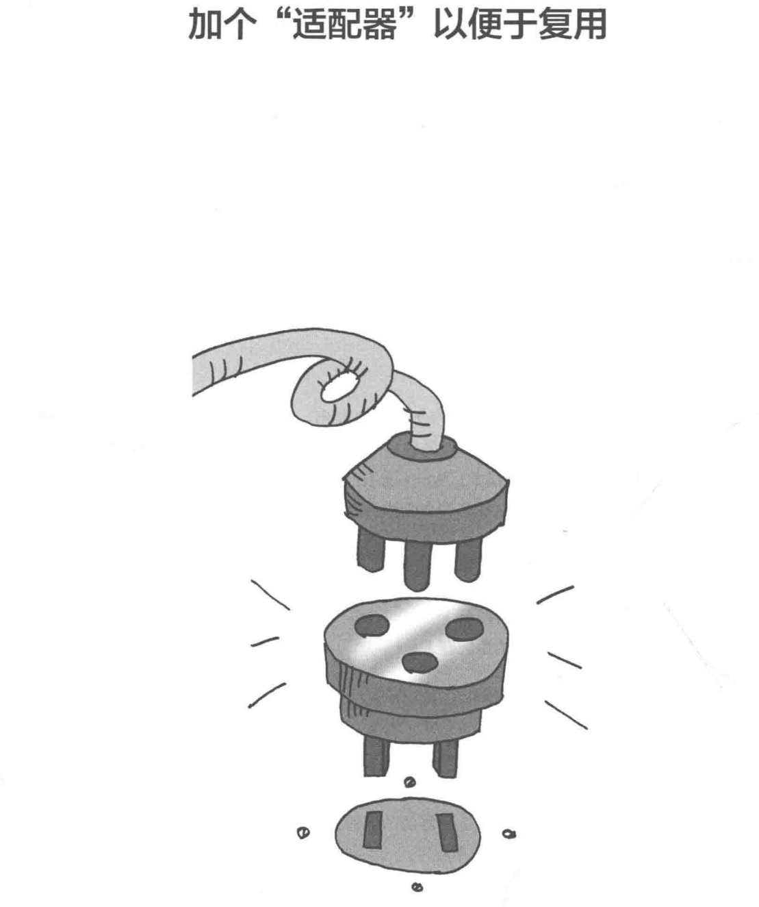
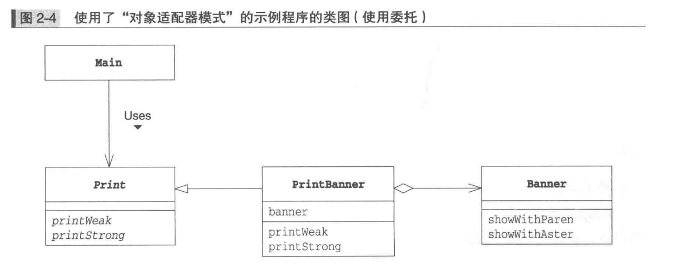

# 1.Adapter模式
如果想让额定工作电压是直流12伏特的笔记本电脑在交流100伏特“的AC
电源下工作，应该怎么做呢?通常，我们会使用AC适配器，将家庭用的交流100
伏特电压转换成我们所需要的直流12伏特电压。这就是适配器的工作，它位于
实际情况与需求之间，填补两者之间的差异。适配器的英文是Adapter，意思
是“使……相互适合的东西”。前面说的AC适配器的作用就是让工作于直流12伏
特环境的笔记本电脑适合于交流100伏特的环境(图2-1)。

# 2.示例程序1（使用继承的适配器）

请注意，这里我们将PrintBanner类的实例保存在了Print类型的变量中。在Main
类中，我们是使用Print接口(即调用printWeak方法和printStrong方法)来进行
编程的。Main类的代码而言，Banner类、showWithParen方法和showWithAster
方法被完全隐藏起来了。这就好像笔记本电脑只要在直流12伏特电压下就能正常工
作，但它并不知道这12伏特的电压是由适配器将100伏特交流电压转换而成的。

`Main类并不知道PrintBanner类是如何实现的，这样就可以在不用对Main类进行
修改的 情况下改变PrintBanner类的具体实现。
`
# 3.示例程序2（使用委托的示例程序）
之前的示例程序展示了类适配器模式。下面我们再来看看对象适配器模式。在之前
的示例程序中，我们使用“继承”实现适配，而这次我们要使用“委托”来实现适配。

Main类和Banner类与示例程序(1)中的内容完全相同，不过这里我们假设Print 
不是接口而是类。

也就是说，我们打算利用Banner类实现一个类，该类的方法和Print类的方法相
同。由于在Java 中无法同时继承两个类(只能是单一继承)，因此我们无法将
PrintBanner类分别定义为Print类和 Banner类的子类。

PrintBanner类的 banner字段中保存了Banner类的实例 该实例是在
PrintBanner类的构造函数中生成的。然后，printWeak方法和printStrong
方法会通过banner字段调用Banner类的showWithParen和 showWithAster方法。

与之前的示例代码中调用了从父类中继承的showWithParen方法和showWithAster
方法不同,这次我们通过字段来调用这两个方法。

这样就形成了一种委托关系(图2-4)。当PrintBanner类的printWeak被调用的
时候，并不是PrintBanner类自己进行处理，而是将处理交给了其他实例
(Banner 类的实例)的 showWithParen方法。

# 4.拓展思路的要点

# 5.相关的设计模式

